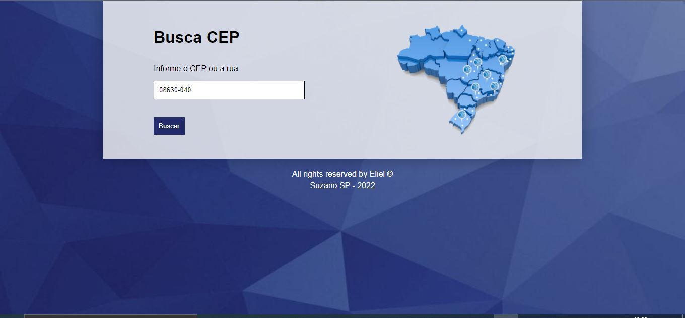
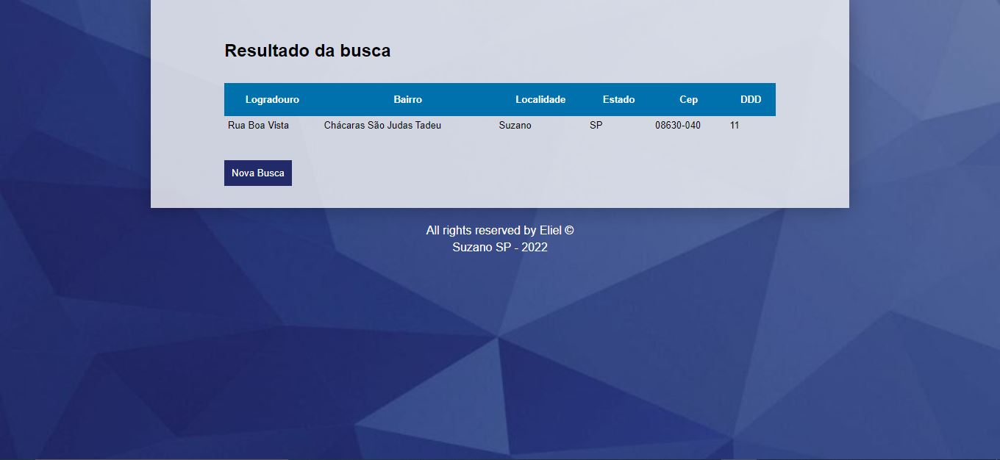
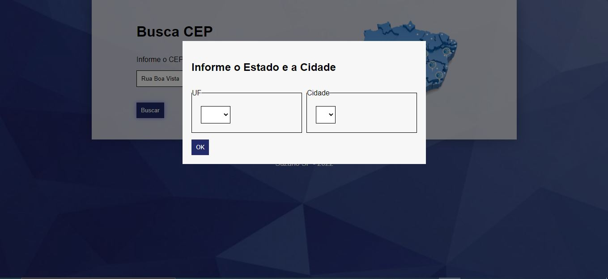
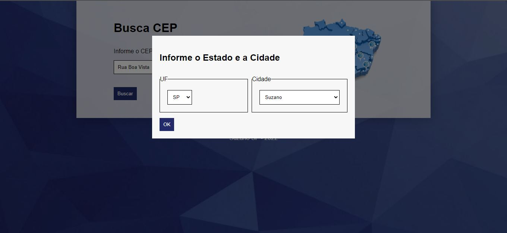

# Busca CEP

## O Busca CEP é uma aplicação javascript,usando ajax, para localizar endereços através do CEP ou o CEP através da rua(logradouro);

&nbsp;

### Na tela inicial tem um campo de busca, que pode ser preenchido com o CEP ou a rua. O javascript usa o RegExp para fazer a validação.
&nbsp;

* **Tela principal com CEP**

&nbsp;

* **Tela de resultado do CEP**

&nbsp;

### Quando a consulta for pela rua, é exibido um modal, que solicitará o estado e a cidade.
&nbsp;

* **Tela do modal**

&nbsp;

### Quando o estado estiver selecionado as cidades serão carregadas
&nbsp;

* **Tela do modal preenchido**

&nbsp;

* **Tela de resultado da Rua**

*Link da aplicação :* https://eliel10.github.io/busca-cep/

